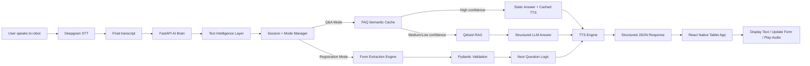

# ECU Admission Robot — Full AI Brain Master Plan

**Project:** ECU Interactive Admission & Guidance Robot  
**Module owner:** AI Brain / Text Intelligence / TTS / Form Understanding  
**Frontend team:** React Native tablet app  
**STT team:** Deepgram Speech-to-Text  
**Target environment:** Physical admission robot/kiosk at Egyptian Chinese University  
**Scope:** Complete system plan, not MVP  
**Version:** 1.0

---

## 0. Purpose of This Document

This file is the complete implementation reference for building the **AI Brain** of the ECU admission robot.

The goal is that any developer or AI coding assistant can read this file and understand:

- what the system does,
- what technologies will be used,
- how the modules connect,
- how text is cleaned before entering the brain,
- how questions are answered,
- how registration form-filling works,
- how the brain outputs text and speech,
- how to implement the system phase by phase.

This plan assumes the robot has a large tablet/screen. The screen can show college advertisements, instructions, answers, form fields, confirmation prompts, and staff-escalation messages. The AI Brain is responsible for generating clean structured responses for that screen and generating or requesting TTS audio for spoken replies.

---

## 1. System Vision

The ECU Admission Robot helps applicants and newcomers during the admission process.

The applicant may be coming from:

- National / Thanaweya Amma school,
- American Diploma,
- IGCSE / IG,
- STEM,
- Al-Azhar,
- another school system.

The robot should help the applicant:

1. Understand ECU and its faculties.
2. Ask questions about admission, faculties, specializations, fees, documents, dates, location, requirements, and general campus information.
3. Fill the ECU registration/admission form by voice.
4. Receive short, clear, safe answers in Arabic or English.
5. Get connected to staff when the system is uncertain.

The AI Brain should behave like a **controlled decision system**, not like a free chatbot.

```text
Clean → Protect → Understand → Retrieve → Validate → Answer → Speak
```

---

## 2. Core Non-Negotiable Requirements

### 2.1 Reliability

The robot must not invent ECU facts. If it does not know, it must say so and escalate to staff.

### 2.2 Speed

The brain should avoid unnecessary LLM calls. It should answer common questions from cache and use RAG only when needed.

### 2.3 Text robustness

The input text from STT may contain:

- wrong spelling,
- missing letters,
- Arabic/English mixing,
- colloquial Arabic,
- wrong word order,
- repeated words,
- noisy filler words,
- numbers spoken as words,
- same question expressed in many different ways.

The system must handle this before routing.

### 2.4 Full registration form support

The system must implement the full form schema, even if some fields are filled manually by the tablet UI or staff.

### 2.5 Language lock

The user chooses Arabic or English manually at the start. After that:

- Arabic session → all answers must be Arabic.
- English session → all answers must be English.

The output language should not switch just because the STT text contains mixed words.

### 2.6 Human escalation

When confidence is low, the robot must not improvise. It should return a fixed safe message asking staff to help.

---

## 3. Team Boundaries

### 3.1 STT Team

Responsible for:

- microphone/audio capture,
- Deepgram streaming or final transcript generation,
- sending the final user transcript to the AI Brain.

The AI Brain expects to receive the **final transcript**, not unstable interim text.

### 3.2 React Native Team

Responsible for:

- tablet UI,
- language selection screen,
- idle advertisement screen,
- displaying answers,
- rendering form fields,
- highlighting current field,
- showing confirmation prompts,
- playing returned audio,
- sending button actions and mode overrides to the AI Brain.

### 3.3 AI Brain Team

Responsible for:

- text preparation,
- session memory,
- mode routing,
- FAQ semantic matching,
- RAG retrieval,
- LLM controlled answer generation,
- registration extraction,
- validation,
- next-question logic,
- TTS text generation,
- TTS audio generation/caching,
- structured JSON output to React Native,
- logging and analytics.

---

## 4. Final Recommended Tech Stack

This is the final strong-stack architecture.

| Layer | Final Choice | Purpose |
|---|---|---|
| Backend | Python + FastAPI | Main AI Brain API and orchestrator |
| ASGI server | Uvicorn | Run FastAPI backend |
| Main database | PostgreSQL | Permanent sessions, applications, logs, knowledge metadata |
| Active cache | Redis | Fast session memory, current topic, mode, FAQ/TTS cache |
| Vector DB | Qdrant | Semantic search and RAG retrieval |
| Simpler vector fallback | pgvector | Use only if Qdrant setup is not possible |
| Validation | Pydantic v2 | Strict schemas for requests, responses, and form fields |
| DB migrations | Alembic | Version database schema cleanly |
| ORM / DB access | SQLAlchemy 2.0 async or SQLModel | Database models and async queries |
| Text normalization | unicodedata + regex + PyArabic | Arabic/English cleanup and digit normalization |
| Fuzzy matching | RapidFuzz | Correct noisy ECU-specific terms |
| Embeddings | BAAI/bge-m3 or multilingual-e5-base | Arabic/English semantic matching |
| LLM | Fast API model with structured JSON output | Controlled answer generation and extraction |
| TTS | Azure Speech TTS | Arabic/English production voice with SSML support |
| Local TTS fallback | Piper/Kokoro | Optional offline fallback |
| Logs | JSONL + PostgreSQL tables | Debugging and continuous improvement |
| Config | `.env` + pydantic-settings | API keys and environment settings |
| Deployment | Docker Compose | Run FastAPI, Postgres, Redis, Qdrant together |

### 4.1 Why PostgreSQL instead of SQLite

Use PostgreSQL because this is a full team system, not a simple local script.

PostgreSQL will store:

- applicants,
- sessions,
- turns,
- form states,
- field-level updates,
- unanswered queries,
- admin-reviewed FAQ updates,
- knowledge metadata,
- audit trail.

SQLite is only acceptable for a quick local prototype, but the final plan uses PostgreSQL.

### 4.2 Why Redis

Redis stores fast-changing active state:

- session mode,
- selected language,
- last 2–3 turns,
- current topic,
- current form field,
- temporary form state,
- cached FAQ answers,
- cached TTS audio references.

This keeps the brain fast.

### 4.3 Why Qdrant

Qdrant is used for semantic search over ECU knowledge chunks.

It supports:

- dense vector search,
- metadata filtering,
- hybrid retrieval if needed,
- fast local or server deployment.

The knowledge source can still start as JSON files, but the runtime system should not search scattered JSON files directly. The JSON files should be ingested, validated, chunked, embedded, and indexed.

---

## 5. High-Level System Architecture



---

## 6. Main Runtime Modes

The brain operates in strict modes.

| Mode | Meaning | Main Handler |
|---|---|---|
| `idle` | Robot is showing ads or welcome screen | React Native mostly handles this |
| `language_select` | User chooses Arabic or English | Session manager |
| `qa` | Applicant asks questions about ECU | FAQ + RAG brain |
| `registration` | Applicant is filling the form | Form extraction engine |
| `confirmation` | User confirms sensitive/important data | Confirmation handler |
| `staff_help` | System escalates to staff | Fixed safe response |
| `end` | Session completed/reset | Session manager |

### 6.1 Mode switching commands

The brain should recognize these intents:

| User Meaning | Action |
|---|---|
| Start application / apply now | Switch to `registration` |
| Ask a question | Stay/switch to `qa` |
| Repeat | Repeat last response |
| Go back | Return to previous form field or previous UI screen |
| Cancel | Ask confirmation, then reset mode |
| Talk to staff | Switch to `staff_help` |
| Change language | Ask user to confirm language reset |

---

## 7. End-to-End Request Flow

Every user turn should pass through this exact order.

```text
1. Receive final transcript from Deepgram
2. Store raw text
3. Normalize text
4. Extract and protect sensitive entities
5. Correct domain-specific words
6. Build search-friendly query
7. Load session memory
8. Detect mode and intent
9. Route to Q&A or Registration
10. Validate result
11. Generate display_text and speech_text
12. Generate or fetch cached TTS audio
13. Save turn logs
14. Return structured JSON to React Native
```

---

## 8. Text Intelligence Layer

This is one of the most important parts of the system.

The transcript must not go directly to the LLM. It must first pass through a controlled text processing pipeline.

### 8.1 Text versions to store

For every user message, store multiple versions:

```json
{
  "raw_text": "اصل انا عايز اعرف هندسه مصاريفها كام",
  "unicode_normalized_text": "اصل انا عايز اعرف هندسه مصاريفها كام",
  "entity_protected_text": "اصل انا عايز اعرف هندسه مصاريفها كام",
  "cleaned_text": "انا عايز اعرف هندسه مصاريفها كام",
  "corrected_text": "انا عايز اعرف كلية الهندسة مصاريفها كام",
  "search_query": "tuition fees faculty engineering",
  "detected_language": "ar",
  "entities": {
    "faculty": "engineering"
  }
}
```

Do not overwrite raw text. Raw text is needed for debugging.

### 8.2 Text Intelligence pipeline

```text
Deepgram final transcript
→ raw text store
→ Unicode normalization
→ Arabic/English digit normalization
→ spoken-number conversion
→ protected entity extraction
→ Arabic normalization
→ filler-word removal
→ domain dictionary correction
→ fuzzy correction
→ semantic search query generation
→ intent classification
→ brain routing
```

### 8.3 Step 1 — Unicode normalization

Normalize:

- extra spaces,
- invisible characters,
- Arabic punctuation,
- English punctuation,
- mixed digit forms,
- right-to-left formatting issues.

Use:

- `unicodedata.normalize("NFKC", text)`,
- regex whitespace cleanup,
- Arabic punctuation mapping.

### 8.4 Step 2 — Digit normalization

Convert all digits to ASCII:

| Input | Output |
|---|---|
| `٠١٢٣٤٥٦٧٨٩` | `0123456789` |
| `۰۱۲۳۴۵۶۷۸۹` | `0123456789` |
| `99٫3` | `99.3` |
| `٩٩.٣` | `99.3` |

### 8.5 Step 3 — Spoken number conversion

The STT may output phone numbers or national IDs as words.

Examples:

| Spoken/STT text | Normalized |
|---|---|
| `صفر واحد صفر اتنين` | `0102` |
| `زيرو وان زيرو تو` | `0102` |
| `عشرة زيرو اتنين` | `0102` if context is phone number |
| `تسعة وتسعين فاصلة تلاتة` | `99.3` |
| `ninety nine point three` | `99.3` |

Do this before regex extraction.

### 8.6 Step 4 — Protected entity extraction

Before any fuzzy correction, extract and protect:

- national ID,
- passport number,
- mobile number,
- home phone,
- email,
- date of birth,
- percentage,
- total marks,
- names,
- faculty choices.

Example:

```text
Raw: my number is 01012345678 and my name is Ahmed Ali
Protected: my number is <PHONE_1> and my name is <NAME_1>
Entities: {"PHONE_1": "01012345678", "NAME_1": "Ahmed Ali"}
```

This prevents RapidFuzz or the LLM from corrupting sensitive values.

### 8.7 Step 5 — Arabic normalization

Create a normalized version for search only.

Possible rules:

| Rule | Example |
|---|---|
| Remove tashkeel | `مُحَمَّد` → `محمد` |
| Remove tatweel | `جامــعة` → `جامعة` |
| Normalize hamza forms | `أ`, `إ`, `آ` → `ا` |
| Normalize alef maqsoora | `ى` → `ي` |
| Normalize taa marbuta for search only | `هندسة` may be searchable as `هندسه` |

Important: keep the original version for display and names. Do not over-normalize official names.

### 8.8 Step 6 — Filler-word removal

Remove or downweight non-useful words from search:

Arabic examples:

- يعني
- لو سمحت
- من فضلك
- طب
- طيب
- هو
- اصل
- معلش

English examples:

- please
- like
- actually
- can you
- I want to know

Do not remove words from the raw text. Remove only in `search_query`.

### 8.9 Step 7 — Domain dictionary correction

Create a controlled dictionary for ECU-specific terms.

Example file: `app/data/dictionaries/domain_terms.json`

```json
{
  "ecu": ["ecu", "e c u", "اي سي يو", "الجامعة الصينية", "egyptian chinese university"],
  "faculty_engineering": ["engineering", "eng", "هندسة", "هندسه", "كلية الهندسة"],
  "faculty_pharmacy": ["pharmacy", "صيدلة", "صيدله", "كلية الصيدلة"],
  "faculty_physical_therapy": ["physical therapy", "علاج طبيعي", "العلاج الطبيعي"],
  "faculty_business": ["business", "business administration", "ادارة اعمال", "بيزنس"],
  "tuition_fees": ["fees", "fee", "tuition", "مصاريف", "المصاريف", "تكلفة"],
  "location": ["where", "location", "مكان", "فين", "اروح ازاي"]
}
```

### 8.10 Step 8 — RapidFuzz correction rules

Use RapidFuzz only against known domain terms.

| Similarity | Action |
|---|---|
| `>= 90` | Auto-map to domain term |
| `80–89` | Use as candidate but do not replace display text |
| `65–79` | Keep original, add weak candidate |
| `< 65` | Ignore |

Never use fuzzy matching to rewrite names, national IDs, emails, or phone numbers.

### 8.11 Step 9 — Search query generation

The search query is not the displayed text. It is a normalized representation for retrieval.

Example:

```json
{
  "raw_text": "فين هندسه ومصاريفها كام",
  "corrected_text": "فين كلية الهندسة ومصاريفها كام",
  "search_query": "faculty_engineering location tuition_fees",
  "intent_candidates": ["faculty_location", "faculty_fees"]
}
```

---

## 9. Session Memory

The brain must remember short-term context per session.

### 9.1 Session state stored in Redis

```json
{
  "session_id": "sess_123",
  "language": "en",
  "mode": "qa",
  "current_topic": "faculty_engineering",
  "current_intent": "tuition_fees",
  "current_form_field": null,
  "last_turns": [
    {
      "user": "Tell me about engineering",
      "assistant": "The Faculty of Engineering offers...",
      "topic": "faculty_engineering"
    },
    {
      "user": "How much is it?",
      "assistant": "The fees are...",
      "topic": "faculty_engineering_fees"
    }
  ]
}
```

### 9.2 Context resolution examples

| User says | Memory has | Brain understands |
|---|---|---|
| `How much is it?` | last topic = engineering | engineering fees |
| `Where is it?` | last topic = pharmacy | pharmacy location |
| `What papers do I need?` | current mode = admission | admission required documents |
| `I want the second one` | prior answer had options | choose option 2 |

---

## 10. Q&A Brain

The Q&A brain answers ECU-related questions.

### 10.1 Q&A topics

The knowledge base should cover:

- ECU overview,
- faculties,
- departments,
- specializations,
- admission requirements,
- required documents,
- tuition fees,
- application deadlines,
- payment methods,
- scholarships or discounts if officially available,
- campus location,
- building locations,
- contact numbers,
- transportation if officially available,
- academic calendar,
- labs and facilities,
- student services,
- events and announcements,
- frequently asked questions.

### 10.2 Routing tiers

```text
Tier 0: Commands and mode actions
Tier 1: FAQ semantic cache
Tier 2: Qdrant RAG retrieval
Tier 3: Controlled LLM answer from retrieved context
Tier 4: Staff fallback
```

### 10.3 Confidence thresholds

| Condition | Action |
|---|---|
| Command intent detected | Execute command immediately |
| FAQ score `>= 0.90` | Return static FAQ answer |
| FAQ score `0.82–0.89` and margin clear | Return FAQ answer |
| FAQ score `0.82–0.89` and margin unclear | Ask clarification |
| RAG score `>= 0.60` | Generate answer using retrieved context |
| RAG score `0.45–0.59` | Ask clarification |
| RAG score `< 0.45` | Staff fallback |
| Two intents too close | Ask clarification |
| No source found | Staff fallback |

### 10.4 FAQ cache format

File: `app/data/faqs/faqs.json`

```json
[
  {
    "intent_id": "engineering_location",
    "topic": "faculty_engineering",
    "language": "both",
    "paraphrases": [
      "Where is the Faculty of Engineering?",
      "How can I go to engineering?",
      "فين مبنى هندسة؟",
      "كلية الهندسة مكانها فين؟"
    ],
    "answer_en": "The Faculty of Engineering is located in ...",
    "answer_ar": "كلية الهندسة موجودة في ...",
    "speech_en": "The Faculty of Engineering is located in ...",
    "speech_ar": "كلية الهندسة موجودة في ...",
    "source": "manual_verified",
    "last_verified_at": "YYYY-MM-DD"
  }
]
```

### 10.5 RAG knowledge JSON format

Your team can prepare JSON files like this:

```json
{
  "document_id": "engineering_admission_2026",
  "title": "Faculty of Engineering Admission Requirements",
  "language": "en",
  "category": "admission_requirements",
  "faculty": "engineering",
  "source_url": "https://...",
  "last_updated": "YYYY-MM-DD",
  "verified_by": "admission_team",
  "content": [
    {
      "section_title": "Requirements",
      "text": "Official verified text goes here."
    }
  ]
}
```

### 10.6 Knowledge ingestion pipeline

```text
JSON files
→ schema validation
→ cleaning
→ chunking
→ metadata tagging
→ embedding generation
→ Qdrant indexing
→ PostgreSQL metadata storage
```

Do not scrape the ECU website live during a user conversation. Live scraping makes the robot slow and unreliable.

Recommended process:

1. Scrape/update website data separately.
2. Convert to clean JSON.
3. Let staff or team verify important facts.
4. Ingest into Qdrant and PostgreSQL.
5. Runtime answers from indexed local verified data.

### 10.7 RAG answer rule

The LLM must answer only from retrieved ECU context.

If the retrieved context does not contain the answer, the LLM must return:

```json
{
  "can_answer": false,
  "answer": null,
  "reason": "missing_context"
}
```

Then the brain returns staff fallback.

---

## 11. LLM Usage Rules

The LLM is not the brain. The LLM is only a controlled tool inside the brain.

### 11.1 Use LLM for

- summarizing retrieved ECU context,
- extracting free-text registration fields,
- generating a short natural reply from verified facts,
- asking a clarification question.

### 11.2 Do not use LLM for

- national ID regex extraction,
- phone number regex extraction,
- email extraction,
- choosing unsupported facts,
- answering without retrieved context,
- making decisions without confidence checks,
- replacing the full router.

### 11.3 LLM output must be JSON

All LLM calls must use strict structured output.

Example Q&A output:

```json
{
  "can_answer": true,
  "answer_display": "The Faculty of Engineering offers several specializations. Please check the admission office for the final current availability.",
  "answer_speech": "The Faculty of Engineering offers several specializations. For the final current availability, please check the admission office.",
  "confidence": 0.86,
  "topic": "faculty_engineering",
  "needs_staff": false,
  "sources_used": ["engineering_admission_2026_chunk_3"]
}
```

### 11.4 Q&A system prompt template

```text
You are the ECU Admission Robot AI Brain.
You answer applicants only about Egyptian Chinese University.
Use only the provided official ECU context.
Do not invent fees, dates, requirements, phone numbers, departments, or policies.
If the answer is missing from context, return can_answer=false.
Return only valid JSON matching the required schema.
The session language is: {language}. Respond only in that language.
Keep the answer short, clear, friendly, and suitable for voice.
```

### 11.5 Registration extraction prompt template

```text
You are an information extraction engine for the ECU admission form.
Extract only fields that are clearly present in the user text.
Do not guess missing values.
Do not rewrite names aggressively.
Normalize school system to one of the allowed enums.
Return only valid JSON matching the RegistrationExtraction schema.
The session language is: {language}; however extracted values must preserve the user's actual names and numbers.
```

---

## 12. Full Registration Form Engine

Registration form-filling is a separate system from Q&A.

```text
Registration transcript
→ text intelligence layer
→ protected entity extraction
→ regex extraction
→ LLM structured extraction
→ Pydantic validation
→ update form state
→ confirmation logic
→ next-question selection
→ response + TTS
```

### 12.1 Field state object

Every form field should be stored with metadata.

```json
{
  "field_name": "student_mobile",
  "value": "01012345678",
  "confidence": 0.97,
  "source_text": "my phone number is 01012345678",
  "confirmed": false,
  "needs_confirmation": true,
  "updated_at": "YYYY-MM-DDTHH:MM:SS"
}
```

### 12.2 Full form sections

The scanned ECU form contains these main sections:

1. Personal Data
2. School / Certificate Data
3. Family / Guardian Information
4. Received Papers
5. College Preferences
6. Internal administrative fields

### 12.3 Personal Data fields

| Field Key | Label | Voice? | Confirmation? | Notes |
|---|---|---:|---:|---|
| `full_name_en` | Full Name in English | Yes | Yes | Preserve spelling; allow screen edit |
| `full_name_ar` | Full Name in Arabic | Yes | Yes | Ask if Arabic mode; can be typed manually |
| `date_of_birth` | Date of Birth | Yes | Yes | Normalize to ISO date if possible |
| `place_of_birth` | Place of Birth | Yes | No | City/governorate |
| `nationality` | Nationality | Yes | No | Default not assumed unless said |
| `id_or_passport` | ID / Passport | Yes | Yes | Sensitive; protect and mask in speech |
| `gender` | Gender | Yes | Yes | Enum |
| `marital_status` | Marital Status | Optional | No | Usually single; do not assume |
| `country` | Country | Yes | No | Address country |
| `district` | District | Yes | No | Address district |
| `city` | City | Yes | No | Address city |
| `home_phone` | Home Phone | Optional | Yes | Sensitive |
| `address` | Address | Yes | Yes | Free text; screen edit recommended |
| `email_address` | Email Address | Yes | Yes | Spell carefully; visual confirmation required |
| `mobile_no_2` | Mobile No. 2 | Optional | Yes | Secondary mobile |
| `student_mobile_no` | Student Mobile No. | Yes | Yes | Required priority |
| `username` | Username | No | No | Prefer system-generated or staff/UI entry |
| `password` | Password | No | No | Do not collect by voice in public |

### 12.4 School / Certificate fields

| Field Key | Label | Voice? | Confirmation? | Notes |
|---|---|---:|---:|---|
| `school_country` | School Country | Yes | No | If mentioned |
| `school_name` | School Name | Yes | Yes | Free text; do not over-correct |
| `certificate_type` | Certificate | Yes | Yes | Enum: Thanaweya Amma, American, IGCSE, STEM, Al-Azhar, Other |
| `year_of_completion` | Year of Completion | Yes | Yes | Four-digit year |
| `percentage` | Percentage | Yes | Yes | 0–100 |
| `total_marks` | Total Marks | Optional | Yes | Numeric/free text depending system |
| `sector_science` | Science Sector | Yes | Yes | Enum or boolean |
| `sector_math` | Math Sector | Yes | Yes | Enum or boolean |
| `sector_literary` | Literary Sector | Yes | Yes | Enum or boolean |

### 12.5 Guardian / Family fields

| Field Key | Label | Voice? | Confirmation? | Notes |
|---|---|---:|---:|---|
| `guardian_name` | Guardian Name | Yes | Yes | Free text |
| `guardian_id_or_passport` | Guardian ID / Passport | Optional | Yes | Sensitive |
| `guardian_relationship` | Relationship | Yes | Yes | Father, Mother, Other |
| `guardian_employer` | Employer | Optional | No | Free text |
| `guardian_profession` | Profession | Optional | No | Free text |
| `guardian_nationality` | Nationality | Optional | No | Free text |
| `guardian_country` | Country | Optional | No | Address |
| `guardian_district` | District | Optional | No | Address |
| `guardian_city` | City | Optional | No | Address |
| `guardian_work_address` | Work Address | Optional | No | Free text |
| `guardian_work_no` | Work Phone | Optional | Yes | Phone |
| `guardian_mobile_no` | Mobile No. | Yes | Yes | Important contact |
| `guardian_home_phone` | Home Phone | Optional | Yes | Phone |
| `guardian_email_address` | Email Address | Optional | Yes | Email |

### 12.6 Received Papers fields

These fields may be staff/UI checkboxes instead of voice, but the schema must support them.

| Field Key | Label | Type |
|---|---|---|
| `paper_passport_id_copy` | Passport / ID Copy | boolean/count |
| `paper_passport_id_original` | Passport / ID Original | boolean/count |
| `paper_guardian_id_copy` | Guardian ID Copy | boolean/count |
| `paper_guardian_id_original` | Guardian ID Original | boolean/count |
| `paper_high_school_certificate_copy` | High School Certificate Copy | boolean/count |
| `paper_high_school_certificate_original` | High School Certificate Original | boolean/count |
| `paper_birth_certificate_copy` | Birth Certificate Copy | boolean/count |
| `paper_birth_certificate_original` | Birth Certificate Original | boolean/count |
| `paper_personal_photos_count` | Personal Photos Count | number |

### 12.7 College preference fields

The form supports six college preferences.

| Field Key | Label | Voice? | Confirmation? |
|---|---|---:|---:|
| `college_preference_1` | Preference 1 | Yes | Yes |
| `college_preference_2` | Preference 2 | Yes | Yes |
| `college_preference_3` | Preference 3 | Yes | Yes |
| `college_preference_4` | Preference 4 | Optional | Yes |
| `college_preference_5` | Preference 5 | Optional | Yes |
| `college_preference_6` | Preference 6 | Optional | Yes |

### 12.8 Administrative fields

| Field Key | Label | Voice? | Notes |
|---|---|---:|---|
| `application_serial` | Form Serial Number | No | From form/system |
| `academic_year` | Academic Year | No | System/admin |
| `college_registered_final` | Final College | No | Admission decision/admin |
| `internal_notes` | Internal Notes | No | Staff only |

---

## 13. Registration Question Order

The system should not ask every field in random order. Use priority order.

### 13.1 Priority voice flow

1. Select language.
2. Ask if user wants to ask questions or start registration.
3. If registration starts:
   1. Full name.
   2. Student mobile number.
   3. National ID or passport.
   4. Email address.
   5. Date of birth.
   6. Nationality.
   7. Address: city, district, detailed address.
   8. School/certificate type.
   9. School name.
   10. Year of completion.
   11. Percentage or total marks.
   12. Sector/branch.
   13. First college preference.
   14. Other college preferences.
   15. Guardian name.
   16. Guardian relationship.
   17. Guardian mobile.
   18. Optional guardian details.
   19. Review summary.
   20. Final confirmation.

### 13.2 Next-question algorithm

```text
1. Load current form state.
2. Validate fields already filled.
3. Find first missing required field.
4. If a sensitive field was just extracted, ask for confirmation.
5. If no required fields are missing, show review summary.
6. If review confirmed, submit application.
```

### 13.3 Handling over-informing

If the user says:

```text
My name is Ahmed Mohamed, I graduated from STEM in 2024, my percentage is 98.7, and my phone is 01012345678.
```

The brain should extract all fields in one turn:

```json
{
  "full_name_en": "Ahmed Mohamed",
  "certificate_type": "STEM",
  "year_of_completion": "2024",
  "percentage": 98.7,
  "student_mobile_no": "01012345678"
}
```

Then it asks only for the next missing field.

### 13.4 Handling corrections

If the user says:

```text
No, my phone number is 01098765432.
```

The brain should detect correction intent and update the existing field.

Output:

```json
{
  "form_updates": {
    "student_mobile_no": {
      "value": "01098765432",
      "confirmed": false,
      "needs_confirmation": true
    }
  },
  "speech_text": "I updated your mobile number. Please confirm it on the screen."
}
```

---

## 14. Validation Rules

### 14.1 National ID / Passport

- Egyptian national ID should be 14 digits.
- If passport, allow alphanumeric format.
- Never auto-correct ID digits.
- Always ask for visual confirmation.
- In speech, do not read the full ID loudly unless requested; prefer masked display.

### 14.2 Egyptian mobile number

Allowed common prefixes:

- `010`
- `011`
- `012`
- `015`

Format:

```text
^01[0125][0-9]{8}$
```

Always visually confirm.

### 14.3 Email

- Extract with regex.
- Normalize common STT phrases:
  - `at` → `@`
  - `dot` → `.`
  - `gmail dot com` → `gmail.com`
- Always visually confirm.

### 14.4 Percentage

- Must be between 0 and 100.
- Handle Arabic decimal separator.
- Confirm visually.

### 14.5 Certificate type enum

Allowed values:

```text
Thanaweya Amma
American
IGCSE
STEM
Al-Azhar
Other
```

Aliases:

| Input | Normalized |
|---|---|
| `national` / `ثانوية عامة` / `عامه` | Thanaweya Amma |
| `IG` / `IGCSE` / `اي جي` | IGCSE |
| `American Diploma` / `امريكان` | American |
| `مدرسة المتفوقين` / `ستيم` | STEM |
| `ازهر` / `أزهر` | Al-Azhar |

---

## 15. TTS Engine

The TTS engine receives `speech_text`, not raw LLM output.

### 15.1 TTS requirements

- Support Arabic and English.
- Use short sentences.
- Use SSML for digits and IDs.
- Cache common audio.
- Avoid reading sensitive full data loudly.
- Return audio URL or Base64 to React Native.

### 15.2 TTS cache examples

Cache these immediately:

- Welcome message.
- Language selection prompts.
- “Please repeat that.”
- “I am not sure; please ask an admission staff member.”
- Start registration prompt.
- Confirmation prompt.
- Submit success prompt.
- Top FAQ answers.

### 15.3 TTS response object

```json
{
  "audio": {
    "type": "url",
    "url": "/audio/cache/welcome_en.mp3",
    "base64": null,
    "duration_ms": 2300,
    "cache_hit": true
  }
}
```

---

## 16. API Contracts

### 16.1 Start session

`POST /api/v1/sessions/start`

Request:

```json
{
  "language": "en",
  "source": "tablet",
  "device_id": "robot_01"
}
```

Response:

```json
{
  "session_id": "sess_abc123",
  "language": "en",
  "mode": "qa",
  "display_text": "Welcome to ECU. How can I help you today?",
  "speech_text": "Welcome to ECU. How can I help you today?",
  "audio": {
    "type": "url",
    "url": "/audio/cache/welcome_en.mp3"
  }
}
```

### 16.2 Brain turn

`POST /api/v1/brain/turn`

Request:

```json
{
  "session_id": "sess_abc123",
  "text_input": "I want to apply to engineering",
  "language": "en",
  "mode_override": null,
  "stt_metadata": {
    "provider": "deepgram",
    "is_final": true,
    "confidence": 0.91
  },
  "ui_context": {
    "current_screen": "home",
    "focused_field": null
  }
}
```

Response:

```json
{
  "status": "active_registration",
  "route": "registration_extraction",
  "mode": "registration",
  "language": "en",
  "display_text": "Great. Let us start your application. What is your full name?",
  "speech_text": "Great. Let us start your application. What is your full name?",
  "audio": {
    "type": "url",
    "url": "/audio/generated/sess_abc123_turn_001.mp3",
    "cache_hit": false
  },
  "current_topic": "registration",
  "current_form_field": "full_name_en",
  "form_updates": {},
  "needs_confirmation": false,
  "confirmation_field": null,
  "confidence": 0.94,
  "sources": [],
  "ui_actions": [
    {"type": "navigate", "screen": "registration_form"},
    {"type": "focus_field", "field": "full_name_en"}
  ],
  "debug": {
    "cleaned_text": "i want to apply to engineering",
    "intent": "start_registration"
  }
}
```

### 16.3 Submit registration

`POST /api/v1/registration/submit`

Request:

```json
{
  "session_id": "sess_abc123",
  "confirmed": true
}
```

Response:

```json
{
  "status": "submitted",
  "application_id": "app_2026_0001",
  "display_text": "Your application data has been saved. Please wait for an admission staff member to review it.",
  "speech_text": "Your application data has been saved. Please wait for an admission staff member to review it.",
  "ui_actions": [
    {"type": "show_success"}
  ]
}
```

---

## 17. Database Design

### 17.1 PostgreSQL tables

#### `sessions`

| Column | Type | Notes |
|---|---|---|
| `id` | UUID/Text | session id |
| `device_id` | Text | robot/tablet id |
| `language` | Text | `ar` or `en` |
| `mode` | Text | current mode |
| `current_topic` | Text | latest topic |
| `current_form_field` | Text | focused field |
| `created_at` | Timestamp | start time |
| `updated_at` | Timestamp | update time |
| `ended_at` | Timestamp | nullable |

#### `conversation_turns`

| Column | Type |
|---|---|
| `id` | UUID/Text |
| `session_id` | FK |
| `turn_index` | Integer |
| `raw_text` | Text |
| `cleaned_text` | Text |
| `corrected_text` | Text |
| `search_query` | Text |
| `route` | Text |
| `intent` | Text |
| `confidence` | Float |
| `assistant_display_text` | Text |
| `assistant_speech_text` | Text |
| `audio_url` | Text |
| `created_at` | Timestamp |

#### `registration_applications`

Store full form state as columns or JSONB.

Recommended:

- important searchable fields as columns,
- full field metadata as `form_state_jsonb`.

| Column | Type |
|---|---|
| `id` | UUID/Text |
| `session_id` | FK |
| `full_name_en` | Text |
| `full_name_ar` | Text |
| `student_mobile_no` | Text |
| `id_or_passport` | Text encrypted/masked |
| `email_address` | Text |
| `certificate_type` | Text |
| `percentage` | Numeric |
| `college_preference_1` | Text |
| `guardian_name` | Text |
| `guardian_mobile_no` | Text |
| `form_state` | JSONB |
| `status` | Text |
| `created_at` | Timestamp |
| `updated_at` | Timestamp |

#### `registration_field_events`

Track every field update.

| Column | Type |
|---|---|
| `id` | UUID/Text |
| `application_id` | FK |
| `field_name` | Text |
| `old_value` | Text |
| `new_value` | Text |
| `confidence` | Float |
| `source_text` | Text |
| `confirmed` | Boolean |
| `created_at` | Timestamp |

#### `faq_items`

| Column | Type |
|---|---|
| `id` | UUID/Text |
| `intent_id` | Text |
| `topic` | Text |
| `paraphrases` | JSONB |
| `answer_ar` | Text |
| `answer_en` | Text |
| `source` | Text |
| `last_verified_at` | Date |
| `active` | Boolean |

#### `knowledge_documents`

| Column | Type |
|---|---|
| `id` | UUID/Text |
| `title` | Text |
| `category` | Text |
| `faculty` | Text |
| `language` | Text |
| `source_url` | Text |
| `last_updated` | Date |
| `verified_by` | Text |
| `content_hash` | Text |

#### `unanswered_queries`

| Column | Type |
|---|---|
| `id` | UUID/Text |
| `session_id` | FK |
| `raw_text` | Text |
| `cleaned_text` | Text |
| `best_candidate` | Text |
| `confidence` | Float |
| `reason` | Text |
| `created_at` | Timestamp |
| `reviewed` | Boolean |

#### `tts_cache`

| Column | Type |
|---|---|
| `id` | UUID/Text |
| `language` | Text |
| `speech_text_hash` | Text |
| `speech_text` | Text |
| `audio_url` | Text |
| `duration_ms` | Integer |
| `created_at` | Timestamp |

---

## 18. Suggested Project Structure

```text
ecu-ai-brain/
│
├── app/
│   ├── main.py
│   ├── config.py
│   ├── dependencies.py
│   │
│   ├── api/
│   │   ├── routes_sessions.py
│   │   ├── routes_brain.py
│   │   ├── routes_registration.py
│   │   ├── routes_admin.py
│   │   └── routes_health.py
│   │
│   ├── schemas/
│   │   ├── requests.py
│   │   ├── responses.py
│   │   ├── registration.py
│   │   ├── qa.py
│   │   └── common.py
│   │
│   ├── core/
│   │   ├── orchestrator.py
│   │   ├── session_manager.py
│   │   ├── mode_router.py
│   │   ├── confidence.py
│   │   └── guardrails.py
│   │
│   ├── text_intelligence/
│   │   ├── normalizer.py
│   │   ├── digit_parser.py
│   │   ├── entity_extractor.py
│   │   ├── domain_corrector.py
│   │   ├── query_builder.py
│   │   └── language_detector.py
│   │
│   ├── qa/
│   │   ├── faq_cache.py
│   │   ├── semantic_matcher.py
│   │   ├── rag_retriever.py
│   │   ├── llm_answerer.py
│   │   └── source_validator.py
│   │
│   ├── registration/
│   │   ├── form_state.py
│   │   ├── extractors.py
│   │   ├── validators.py
│   │   ├── next_question.py
│   │   ├── confirmation.py
│   │   └── submitter.py
│   │
│   ├── tts/
│   │   ├── tts_service.py
│   │   ├── ssml_builder.py
│   │   ├── audio_cache.py
│   │   └── voices.py
│   │
│   ├── data/
│   │   ├── dictionaries/
│   │   │   ├── domain_terms.json
│   │   │   ├── school_system_aliases.json
│   │   │   └── faculty_aliases.json
│   │   ├── faqs/
│   │   │   └── faqs.json
│   │   └── knowledge/
│   │       └── *.json
│   │
│   ├── db/
│   │   ├── models.py
│   │   ├── session.py
│   │   ├── repositories.py
│   │   └── migrations/
│   │
│   ├── vector/
│   │   ├── qdrant_client.py
│   │   ├── embedding_service.py
│   │   └── ingest.py
│   │
│   ├── logging/
│   │   ├── app_logger.py
│   │   └── event_logger.py
│   │
│   └── tests/
│       ├── test_text_normalization.py
│       ├── test_registration_extraction.py
│       ├── test_qa_routing.py
│       ├── test_rag.py
│       └── test_api_contracts.py
│
├── scripts/
│   ├── ingest_knowledge.py
│   ├── build_faq_embeddings.py
│   ├── prewarm_tts_cache.py
│   └── run_eval.py
│
├── docker-compose.yml
├── requirements.txt
├── .env.example
├── README.md
└── ECU_AI_Brain_Full_System_Master_Plan.md
```

---

## 19. Execution Phases

These phases are implementation order, not a day-by-day schedule.

---

### Phase 0 — Finalize Contracts with Team

#### Goal

Make sure STT, AI Brain, and React Native teams agree on request/response format.

#### Steps

- [ ] Confirm STT sends final transcript only.
- [ ] Confirm React Native sends `session_id`, `language`, `mode_override`, and `ui_context`.
- [ ] Confirm AI Brain returns `display_text`, `speech_text`, `audio`, `form_updates`, and `ui_actions`.
- [ ] Confirm Arabic/English language codes: `ar`, `en`.
- [ ] Confirm screen names used by React Native.

#### Done when

- [ ] One sample request and one sample response work between all teams.

---

### Phase 1 — Backend Skeleton

#### Goal

Create the FastAPI project and basic endpoints.

#### Steps

- [ ] Create project structure.
- [ ] Add `.env.example`.
- [ ] Add FastAPI app in `main.py`.
- [ ] Add health endpoint.
- [ ] Add session start endpoint.
- [ ] Add brain turn endpoint with fake response.
- [ ] Add Pydantic request/response schemas.
- [ ] Add global error handler.
- [ ] Add JSON logging.

#### Done when

- [ ] `/health` works.
- [ ] `/sessions/start` returns session id.
- [ ] `/brain/turn` accepts text and returns valid structured JSON.

---

### Phase 2 — Database + Cache Setup

#### Goal

Set up PostgreSQL, Redis, and Qdrant.

#### Steps

- [ ] Create Docker Compose with Postgres, Redis, Qdrant, backend.
- [ ] Create database models.
- [ ] Create migrations.
- [ ] Create repositories for sessions, turns, applications, unanswered queries.
- [ ] Create Redis session manager.
- [ ] Create Qdrant client wrapper.

#### Done when

- [ ] Session state can be written/read from Redis.
- [ ] Conversation turns are saved in PostgreSQL.
- [ ] Qdrant connection works.

---

### Phase 3 — Text Intelligence Layer

#### Goal

Build robust text preparation before the brain.

#### Steps

- [ ] Implement Unicode normalization.
- [ ] Implement Arabic/English digit normalization.
- [ ] Implement spoken number parser.
- [ ] Implement protected entity extractor.
- [ ] Implement Arabic text normalization.
- [ ] Implement filler-word removal for search.
- [ ] Implement domain dictionary correction.
- [ ] Implement RapidFuzz mapping.
- [ ] Implement search query builder.
- [ ] Return all text versions in debug mode.

#### Done when

- [ ] 100 messy Arabic/English examples normalize correctly.
- [ ] Phone/ID/email are not corrupted.
- [ ] Same-meaning questions map to the same domain intent.

---

### Phase 4 — Session Memory + Mode Router

#### Goal

Make the brain stateful.

#### Steps

- [ ] Implement session state object.
- [ ] Store language lock.
- [ ] Store current mode.
- [ ] Store last 2–3 turns.
- [ ] Store current topic.
- [ ] Store current form field.
- [ ] Implement command detection.
- [ ] Implement mode switching.
- [ ] Implement follow-up resolution.

#### Done when

- [ ] “How much is it?” works after a faculty question.
- [ ] Registration mode bypasses Q&A routing.
- [ ] User can repeat, cancel, go back, and ask for staff.

---

### Phase 5 — FAQ Semantic Cache

#### Goal

Answer common questions instantly.

#### Steps

- [ ] Create `faqs.json`.
- [ ] Add paraphrases in Arabic and English.
- [ ] Generate embeddings at startup or through a script.
- [ ] Implement cosine similarity search.
- [ ] Implement confidence thresholds and margin checks.
- [ ] Return static answer and cached TTS if high confidence.
- [ ] Log low-confidence misses.

#### Done when

- [ ] At least 100 FAQ paraphrases work.
- [ ] Common location/fees/admission questions return under target latency.
- [ ] No LLM call is made for obvious FAQs.

---

### Phase 6 — Knowledge Ingestion + RAG

#### Goal

Answer detailed questions from verified ECU knowledge.

#### Steps

- [ ] Define knowledge JSON schema.
- [ ] Validate team JSON files.
- [ ] Chunk documents.
- [ ] Add metadata: faculty, category, language, source, last updated.
- [ ] Generate embeddings.
- [ ] Store chunks in Qdrant.
- [ ] Store metadata in PostgreSQL.
- [ ] Implement retriever.
- [ ] Implement metadata filtering.
- [ ] Implement no-source fallback.

#### Done when

- [ ] A question retrieves relevant ECU chunks.
- [ ] RAG returns source ids.
- [ ] If no source exists, system refuses and escalates.

---

### Phase 7 — Controlled LLM Answerer

#### Goal

Generate short, safe answers from retrieved context.

#### Steps

- [ ] Create structured output schema.
- [ ] Create Q&A system prompt.
- [ ] Force language lock.
- [ ] Limit answer length.
- [ ] Set temperature low.
- [ ] Validate JSON output.
- [ ] If output invalid, retry once.
- [ ] If still invalid, fallback.

#### Done when

- [ ] LLM never answers without source context.
- [ ] Output always matches schema.
- [ ] Arabic session always returns Arabic.
- [ ] English session always returns English.

---

### Phase 8 — Full Registration Engine

#### Goal

Fill the full ECU registration form by voice and UI updates.

#### Steps

- [ ] Create full Pydantic form schema.
- [ ] Create field metadata.
- [ ] Implement deterministic regex extractors.
- [ ] Implement semantic LLM extractor for names/school/free text.
- [ ] Implement validators.
- [ ] Implement confirmation rules.
- [ ] Implement next-question logic.
- [ ] Implement correction handling.
- [ ] Implement review summary.
- [ ] Implement final submit.

#### Done when

- [ ] Full form state exists.
- [ ] Required fields are collected in order.
- [ ] User can provide multiple fields in one sentence.
- [ ] User can correct a field.
- [ ] Sensitive fields require confirmation.
- [ ] React Native receives live `form_updates`.

---

### Phase 9 — TTS Engine + Audio Cache

#### Goal

Generate natural speech and reduce repeated latency.

#### Steps

- [ ] Create TTS service interface.
- [ ] Add Azure Speech implementation.
- [ ] Add SSML builder.
- [ ] Add sensitive-data masking rules.
- [ ] Add TTS cache table.
- [ ] Prewarm common prompts.
- [ ] Return audio URL/base64 to frontend.
- [ ] Add fallback if TTS fails.

#### Done when

- [ ] Welcome and FAQ audio are cached.
- [ ] Dynamic registration prompts generate audio.
- [ ] Arabic numbers and IDs are handled safely.
- [ ] TTS failure still returns text.

---

### Phase 10 — React Native Integration

#### Goal

Make the tablet app use the brain reliably.

#### Steps

- [ ] Integrate `/sessions/start`.
- [ ] Integrate `/brain/turn`.
- [ ] Render `display_text`.
- [ ] Play returned audio.
- [ ] Apply `form_updates`.
- [ ] Execute `ui_actions`.
- [ ] Highlight focused field.
- [ ] Show confirmation prompts.
- [ ] Show staff fallback screen.

#### Done when

- [ ] User can ask a question and hear answer.
- [ ] User can start registration.
- [ ] Form fields fill on screen.
- [ ] Confirmation buttons update backend state.

---

### Phase 11 — Logging + Admin Improvement Loop

#### Goal

Make the system improve after testing.

#### Steps

- [ ] Log every turn.
- [ ] Log unanswered queries.
- [ ] Log confidence and route.
- [ ] Log RAG sources used.
- [ ] Log registration extraction changes.
- [ ] Create reviewed/unreviewed status for unanswered queries.
- [ ] Create script to convert reviewed questions into FAQ entries.

#### Done when

- [ ] You can open logs and know exactly why each answer happened.
- [ ] Wrong/missed questions become new FAQs or knowledge entries.

---

### Phase 12 — Testing and Evaluation

#### Goal

Make the system strong before public use.

#### Required test sets

- [ ] 100 Arabic Q&A questions.
- [ ] 100 English Q&A questions.
- [ ] 100 noisy STT examples.
- [ ] 50 registration examples.
- [ ] 30 correction examples.
- [ ] 30 out-of-scope questions.
- [ ] 30 follow-up questions.
- [ ] 20 language-mixing examples.

#### Metrics

| Metric | Target |
|---|---:|
| FAQ route accuracy | High |
| RAG source correctness | High |
| Wrong-answer rate | Near zero |
| Fallback correctness | High |
| Form extraction accuracy | High |
| Sensitive field confirmation rate | 100% |
| Average latency | As low as possible |
| Unhandled exceptions | 0 |

#### Done when

- [ ] No unhandled backend crashes.
- [ ] No unsupported answer is invented.
- [ ] All sensitive data is confirmed.
- [ ] The demo can run end-to-end repeatedly.

---

## 20. Guardrails

### 20.1 Out-of-scope topics

If user asks unrelated questions, return:

English:

```text
I am here to help with ECU admission and campus information. Please ask an admission staff member for anything outside this scope.
```

Arabic:

```text
أنا هنا لمساعدتك في معلومات القبول والجامعة المصرية الصينية فقط. من فضلك تواصل مع موظف القبول لأي سؤال خارج هذا النطاق.
```

### 20.2 Missing information fallback

English:

```text
I do not have verified information about that right now. Please check with the admission office to avoid giving you incorrect information.
```

Arabic:

```text
لا أملك معلومة مؤكدة عن هذا الآن. من فضلك راجع مكتب القبول حتى لا أقدّم لك معلومة غير دقيقة.
```

### 20.3 Low confidence clarification

English:

```text
Do you mean admission requirements, tuition fees, or the faculty location?
```

Arabic:

```text
هل تقصد شروط القبول، المصاريف، أم مكان الكلية؟
```

---

## 21. Security and Privacy

Because the system collects personal data, follow these rules:

- Do not log full national IDs in normal logs.
- Mask sensitive values in speech.
- Store sensitive values carefully.
- Do not collect passwords by voice.
- Allow the applicant to review before submission.
- Allow staff to correct data.
- Do not send unnecessary PII to the LLM.
- For LLM extraction, send only the minimum text needed.
- Use confirmation for phone, ID, email, and grades.

---

## 22. Example Complete Turn Scenarios

### 22.1 Q&A cache hit

User:

```text
فين كلية الهندسة؟
```

Brain:

```json
{
  "route": "faq_cache",
  "status": "cache_hit",
  "current_topic": "faculty_engineering_location",
  "display_text": "كلية الهندسة موجودة في ...",
  "speech_text": "كلية الهندسة موجودة في ...",
  "confidence": 0.94
}
```

### 22.2 RAG answer

User:

```text
What are the required papers for admission?
```

Brain:

```json
{
  "route": "rag_answer",
  "status": "answered",
  "display_text": "Required documents include ID/passport, guardian ID, high school certificate, birth certificate, and personal photos. Please check with admission staff for final verification.",
  "speech_text": "Required documents include your ID or passport, guardian ID, high school certificate, birth certificate, and personal photos. Please check with admission staff for final verification.",
  "sources": ["admission_documents_chunk_1"],
  "confidence": 0.83
}
```

### 22.3 Registration extraction

User:

```text
My name is Ahmed Mohamed, my phone is 01012345678, and I finished STEM in 2024 with 98.5 percent.
```

Brain:

```json
{
  "route": "registration_extraction",
  "status": "active_registration",
  "form_updates": {
    "full_name_en": {"value": "Ahmed Mohamed", "confidence": 0.91, "needs_confirmation": true},
    "student_mobile_no": {"value": "01012345678", "confidence": 0.98, "needs_confirmation": true},
    "certificate_type": {"value": "STEM", "confidence": 0.95, "needs_confirmation": false},
    "year_of_completion": {"value": "2024", "confidence": 0.97, "needs_confirmation": false},
    "percentage": {"value": 98.5, "confidence": 0.96, "needs_confirmation": true}
  },
  "current_form_field": "id_or_passport",
  "display_text": "I added your details. Please confirm the highlighted fields, then tell me your National ID or passport number.",
  "speech_text": "I added your details. Please confirm the highlighted fields, then tell me your National ID or passport number."
}
```

---

## 23. Implementation Rules for AI Coding Assistant

When using this file with an AI coding assistant, give this instruction:

```text
Read ECU_AI_Brain_Full_System_Master_Plan.md completely.
Implement only the phase and step I ask for.
Do not change architecture decisions unless I approve.
Use Python FastAPI, PostgreSQL, Redis, Qdrant, Pydantic, PyArabic, RapidFuzz, and structured LLM outputs as specified.
Always keep raw_text, cleaned_text, corrected_text, and search_query separate.
Never send unvalidated unsupported answers to the user.
Registration extraction must be separate from Q&A routing.
All API outputs must match the response schema.
```

---

## 24. Final Build Checklist

### Core system

- [ ] FastAPI backend runs.
- [ ] PostgreSQL connected.
- [ ] Redis connected.
- [ ] Qdrant connected.
- [ ] Session start works.
- [ ] Brain turn works.
- [ ] Structured response works.

### Text intelligence

- [ ] Raw text stored.
- [ ] Digits normalized.
- [ ] Spoken numbers parsed.
- [ ] Entities protected.
- [ ] Domain corrections work.
- [ ] Search query generated.

### Q&A

- [ ] FAQ cache works.
- [ ] RAG ingestion works.
- [ ] RAG retrieval works.
- [ ] LLM answers only from context.
- [ ] Staff fallback works.

### Registration

- [ ] Full form schema exists.
- [ ] Field metadata exists.
- [ ] Regex extraction works.
- [ ] LLM extraction works.
- [ ] Validation works.
- [ ] Confirmation works.
- [ ] Next-question logic works.
- [ ] Submit works.

### TTS

- [ ] Azure TTS works.
- [ ] SSML works.
- [ ] Audio cache works.
- [ ] TTS fallback works.

### Integration

- [ ] React Native receives all required fields.
- [ ] STT sends final transcript.
- [ ] Full user journey works.
- [ ] Logs can explain every decision.

---

## 25. Final Summary

The AI Brain is a controlled, reliable, low-latency admission assistant.

It is not a normal chatbot.

The correct architecture is:

```text
Deepgram transcript
→ Text Intelligence Layer
→ Session Memory
→ Mode Router
→ FAQ Cache or RAG or Registration Engine
→ Validation and Guardrails
→ TTS
→ React Native structured response
```

The strongest implementation stack is:

```text
Python + FastAPI
PostgreSQL
Redis
Qdrant
Pydantic v2
PyArabic
RapidFuzz
BGE-M3 or multilingual-E5 embeddings
Structured-output LLM
Azure Speech TTS
React Native tablet frontend
Deepgram STT input
```

The system must always prioritize:

1. verified ECU information,
2. controlled routing,
3. structured data,
4. user confirmation,
5. fast response,
6. no hallucination,
7. clean integration with the team.
